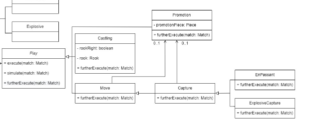

# MultiChess

MultiChess is a chess game which allows the players to experience the power of playing several combinations of different types of chess.

This project was developed by João Ramos(up202108743@fe.up.pt), Matilde Simões(up202108782@fe.up.pt) and Pedro Oliveira(up202004324@fe.up.pt) for LDTS 2022/2023.

## Multichess Features

### Game Modes of Multichess
Multichess has 2 different variations of chess present in this game, traditional and explosive.

#### Traditional Game Mode
In this game mode, the chess board has the regular size of a board in chess and all the pieces have their rules correctly specified.

#### Explosive Game Mode
In this game mode, the chess board is 12*12 squares in size and has some special rules for certain pieces like pawns and horses.
The pawns are explosive, in the sense that, when they captured a piece, all the pieces in a radius of 1 square have captured too.
The horses have a special rule as well, that consists of having Queen and Horse Rules in the same piece.

### Time
Each game has a time for each player (user or bots), and it can change (increase and decrease) depending on the player's preference.

### Changing players
This game provides the option to change both players types, this meaning that either white or black player can be a User or a Bot,
of different difficulties, allowing to the user to play as either white or black against the bot, play a local 1v1 against other person, or watch a match between 2 bots.

### Mouse and buttons
The game features mouse integration, as it is the most versatile option to play Chess.
In any stage of the game, the user may click the _ESC_ button to go back.  

### GameOver
The match ends, when either a checkmate or stalemate occurs, or in the event that one of the players runs out of time.
A GameOver menu appears and the user is provided with the option to play again, or go back to the menu.

### DEMONSTRATION

#### Traditional Chess

#### Explosive Chess

#### Menu

# Architectural Pattern:
The architectural pattern is one of the most important parts in a project of this type, it is responsible for the way we organize the code.

We decided to use the MVC (Model-View-Controller) architectural pattern, presenting the following division:

- Model: Saves the structure of the game and its current state;
- View: It's the part that interacts with the user, presents data from the chess.Model and sends the user's actions to the chess.Controller;
- Controller: Coordinates and processes program states, sends data from chess.Model to chess.View and interprets user actions.

### Implementation:

### Consequences:
It is easier to modify and it also looses coupling between models, views or controllers. The architectural pattern allows good cohesion and it is more easily testable.

# DESIGN PATTERNS

## Game should behave differently depending on its state (match, menu or settings)

### Context of the Problem:

Our game behaves drastically different in different scenarios, like when in a Menu, where inputs are limited and little
to none game logic is processing, and in a match, where there is loads of different gamelogic running and the whole GUI 
interaction differs as well.

### Design Pattern:

We thought about using the **State Pattern** that allows an object to change its behavior when its internal state changes and it appears that the object changes classes.

### Implementation:

These classes can be found in the following files:
- [State](https://github.com/FEUP-LDTS-2022/project-l14gr08/blob/develop/src/main/java/com/ldts2223/chess/states/State.java)
- [GameState](https://github.com/FEUP-LDTS-2022/project-l14gr08/blob/develop/src/main/java/com/ldts2223/chess/states/GameState.java)
- [SettingsState](https://github.com/FEUP-LDTS-2022/project-l14gr08/blob/develop/src/main/java/com/ldts2223/chess/states/SettingsState.java)
- [MenuState](https://github.com/FEUP-LDTS-2022/project-l14gr08/blob/develop/src/main/java/com/ldts2223/chess/states/MenuState.java)

### Consequences

- Easier to add a new state to the game
- It is easier to localize the behavior for the different states, as these are divided
- Make state transitions explicit

## Game should run and update continuously regardless of user input

### Context of the Problem:

Decouple the progression of game time from user input and processor speed.

### Design Pattern:

We chose the **GameLoop** design pattern which ensures that game time renders at the same speed across all different hardware configurations. 
This is an important standard and by using it we ensure that the continuation of our game is independent of user input and processor speed.

### Implementation:

These classes can be found in the following files:
- [State](https://github.com/FEUP-LDTS-2022/project-l14gr08/blob/develop/src/main/java/com/ldts2223/chess/states/State.java)
- [Controller](https://github.com/FEUP-LDTS-2022/project-l14gr08/blob/develop/src/main/java/com/ldts2223/chess/controller/Controller.java)
- [GameController](https://github.com/FEUP-LDTS-2022/project-l14gr08/blob/develop/src/main/java/com/ldts2223/chess/controller/game/GameController.java)
- [MenuController](https://github.com/FEUP-LDTS-2022/project-l14gr08/blob/develop/src/main/java/com/ldts2223/chess/controller/menu/MenuController.java)
- [SettingsController](https://github.com/FEUP-LDTS-2022/project-l14gr08/blob/develop/src/main/java/com/ldts2223/chess/controller/settings/SettingsController.java)
- [PlayerController](https://github.com/FEUP-LDTS-2022/project-l14gr08/blob/develop/src/main/java/com/ldts2223/chess/controller/game/PlayerController.java)
- [MatchController](https://github.com/FEUP-LDTS-2022/project-l14gr08/blob/develop/src/main/java/com/ldts2223/chess/controller/game/MatchController.java)

### Consequences

- The game does not crash due to lack of user input
- The game frame is constantly updated
- Our game variables are updated methodically
- Allows for better frame rate management

## Lanterna Interface

### Context of the Problem:
Frameworks are complex systems as they have more resources than those that will actually be used in a project. 
In this case, we developed a text-based game and used Lanterna as a GUI framework. 
If we directly used Lanterna's methods we would have a more complex code and tightly coupled to the framework.

### Design Pattern:

**Facade** is a structural pattern that provides a simplified interface to a library, framework, or any other complex set of classes.

### Implementation:

These classes can be found in the following files:
- [GUI](https://github.com/FEUP-LDTS-2022/project-l14gr08/blob/develop/src/main/java/com/ldts2223/chess/gui/GUI.java)
- [LanternaGUI](https://github.com/FEUP-LDTS-2022/project-l14gr08/blob/develop/src/main/java/com/ldts2223/chess/gui/LanternaGUI.java)

### Consequences:
- Improve code readability
- Provides a context-specific interface for more generic functionality

## The Game Settings Should Be Modifiable anywhere 

### Context of the Problem:
We need to make sure only one instance of the class Settings would exist throughout the entirety of run-time and need 
to be able to have global access to it.

### Design Pattern:
**Singleton Pattern** is a creational design pattern that makes sure that a class has only one instance 
and provides a global access point to that instance.

### Implementation:

These classes can be found in the following files:
- [Settings](https://github.com/FEUP-LDTS-2022/project-l14gr08/blob/develop/src/main/java/com/ldts2223/chess/model/game/match/Settings.java)

### Consequences:
- Easy access and modification of the only instantiated Settings class

## Pieces should generate plays that can be executed

### Context of the Problem:
Implementing a play directly into each piece subclass would make these classes inflexible, because it would couple them
into a particular play at compile-time, which would make it impossible to choose the play at run-time.

### Design Pattern:
Command is a behavioral design pattern that turns a request into a stand-alone object that contains all information about the request. This transformation lets you pass requests as a method arguments, delay or queue a request’s execution, and support undoable operations

### Implementation:

These classes can be found in the following files:
- [Play](https://github.com/FEUP-LDTS-2022/project-l14gr08/blob/develop/src/main/java/com/ldts2223/chess/model/game/match/plays/Play.java)
- [Castling](https://github.com/FEUP-LDTS-2022/project-l14gr08/blob/develop/src/main/java/com/ldts2223/chess/model/game/match/plays/Castling.java)
- [Promotion](https://github.com/FEUP-LDTS-2022/project-l14gr08/blob/develop/src/main/java/com/ldts2223/chess/model/game/match/plays/Promotion.java)
- [Move](https://github.com/FEUP-LDTS-2022/project-l14gr08/blob/develop/src/main/java/com/ldts2223/chess/model/game/match/plays/Move.java)
- [Capture](https://github.com/FEUP-LDTS-2022/project-l14gr08/blob/develop/src/main/java/com/ldts2223/chess/model/game/match/plays/Capture.java)
- [EnPassant](https://github.com/FEUP-LDTS-2022/project-l14gr08/blob/develop/src/main/java/com/ldts2223/chess/model/game/match/plays/EnPassant.java)
- [ExplosiveCapture](https://github.com/FEUP-LDTS-2022/project-l14gr08/blob/develop/src/main/java/com/ldts2223/chess/model/game/match/plays/ExplosiveCapture.java)

### Consequences:
- Easier to add new plays in the future with the method furtherExecute()

## Generating Different Types of Capture Plays

### Context of the Problem:
We need to be able to generate different types of Capture moves, based on the RulesEngine associated to each Piece, but
while respecting SOLID principles, keeping cohesion throughout the code and make it so it is easy to make new types of 
Capture plays be generated, whitout having to modify code and add conditionals.

### Design Pattern:
Factory Method is a creational design pattern that provides an interface for creating objects in a superclass, 
but allows subclasses to alter the type of objects that will be created.

### Implementation:

These classes can be found in the following files:
- [CaptureEngine](https://github.com/FEUP-LDTS-2022/project-l14gr08/blob/develop/src/main/java/com/ldts2223/chess/model/game/match/pieces/ruleEngine/captureGenerator/CaptureEngine.java)
- [DefaultCaptureEngine](https://github.com/FEUP-LDTS-2022/project-l14gr08/blob/develop/src/main/java/com/ldts2223/chess/model/game/match/pieces/ruleEngine/captureGenerator/DefaultCaptureEngine.java)
- [ExplosiveCaptureEngine](https://github.com/FEUP-LDTS-2022/project-l14gr08/blob/develop/src/main/java/com/ldts2223/chess/model/game/match/pieces/ruleEngine/captureGenerator/ExplosiveCaptureEngine.java)

### Consequences:
- We managed to move the entities creation code into one place in the program, making the code easier to update.
- Introducing new entities into the application without changing existing code it's easier.
- There is a separation between creation and the entities themselves.

------
# Code Smells and Refactoring 

## Object-Orientation Abusers

In the Play class, Move and Capture subclass may have a Promotion as a field, which is wrong because it's a temporary field,
only gets a value under certain circumstances, and because it defeats the purpose a being its own Play subclass as it is 
part of both Capture and Move, which is executed when not null.
A way to correct this, would be to use the **Replace Type Code with Subclasses** and make a PromotionCapture that extends
Capture and a PromotionMove that extendsMove. 
We decided against as we thought it would be overkill and require a bit too many changes.

## Lazy Class
The subclasses of RuleEngine class are examples of lazy classes on our code, as they extend the RuleEngine class, 
but they only use its constructor to define the movement of the associated piece.
One way to solve this code smell would be to pass the captureEngine and the Set of Movements as an argument in the 
RuleEngine constructor, while also making RuleEngine not abstract and removing all subclasses,
but this would complicate the process of defining the pieces movements, in the GameModes.

## Duplicated Code
The classes BishopMovement and RookMovement have similar code in the methods getPlaysInDirection() and getPossiblePlays().
A way to improve the code would be to use the **Pull Up Field** and pass these methods to the class Movement, but this 
would incentive to achieve the same with the KingMovement class, whose method getPlaysInDirection(), is very similar as well,
but not quite the same, so a simple and straight forward **Pull Up Field** wouldn't suffice.

## Data Class
The class Input is a data class, as the class only have getters and setters on his implementation, so the class only stores data.
A way to improve the code would be to use the **Move Method** and the **Extract Method** of the method getBoardPosition() from the class
PlayerController to migrate this method to the class Input, still we think that the method is better on the PlayerController
class, because it is strictly used there.

## Bloater
The Match class is an example of a Large Class because it contains too many methods and fields of code. 
A way to improve to code would be to use the **Extract Class**, which helps to spin the code off into a separate component.
However, the group did not reach a logical solution to separate all methods/fields to be better than it is now.

------
## Testing

### Coverage report

### Pitest 
- [report](pitest)

## Self-Evaluation
The work was equally divided by the three elements of the group. 
